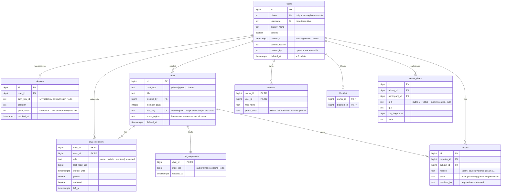
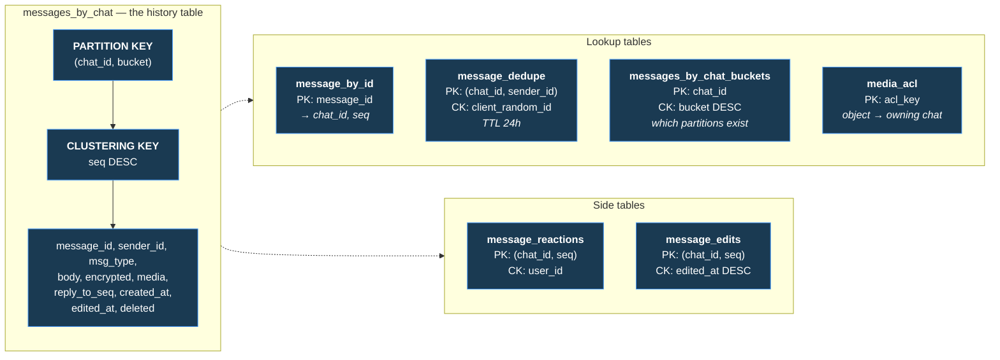
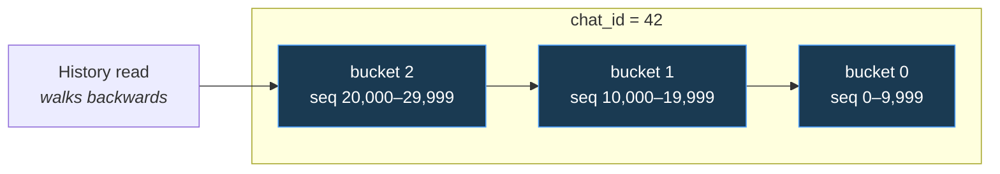

# Messaging platform on Google Cloud

A realtime messaging backend: an MTProto-derived protocol over TCP, UDP and
WebSocket, nine Go services and five Kafka consumers, and the Terraform and
Cloud Build to run it on GKE.

Arabic overview: [README.ar.md](README.ar.md).

---

## System architecture

```mermaid
flowchart TB
    subgraph clients["Clients"]
        web["Web<br/><i>TypeScript MTProto</i>"]
        android["Android<br/><i>Kotlin MTProto</i>"]
        cli["loadgen<br/><i>Go MTProto</i>"]
    end

    subgraph edge["Edge"]
        dns["Cloud DNS<br/><i>geo routing</i>"]
        armor["Cloud Armor<br/><i>WAF + rate limits</i>"]
        https["Global HTTPS LB<br/><i>anycast, TLS 1.2+</i>"]
        nlb["Regional Network LB<br/><i>passthrough TCP/UDP :4443</i>"]
        cdn["Cloud CDN"]
    end

    subgraph gke["GKE regional cluster — Anthos Service Mesh, STRICT mTLS"]
        subgraph rt["realtime-pool"]
            gw["realtime-gateway<br/><i>MTProto termination</i>"]
            turn["coturn<br/><i>DaemonSet, host network</i>"]
        end

        subgraph sl["stateless-pool"]
            auth["auth-service"]
            chat["chat-service"]
            presence["presence-service"]
            media["media-service"]
            notif["notification-service"]
            search["search-service"]
            call["call-service"]
            admin["admin-service<br/><i>no public route</i>"]
        end

        subgraph cons["consumers"]
            persister["persister"]
            pusher["pusher"]
            indexer["indexer"]
            mediaproc["mediaproc<br/><i>+ ClamAV sidecar</i>"]
            auditor["auditor"]
        end

        subgraph sf["stateful-pool"]
            cass[("Cassandra<br/>StatefulSet")]
        end
    end

    subgraph managed["Managed services"]
        kafka["Managed Kafka<br/><i>SASL/OAUTHBEARER</i>"]
        sql[("Cloud SQL<br/>PostgreSQL HA")]
        redis[("Memorystore<br/>Redis Cluster")]
        gcs["Cloud Storage"]
        es[("Elasticsearch")]
        fcm["FCM"]
        sm["Secret Manager<br/>+ Cloud KMS"]
    end

    web & android --> dns
    cli --> dns
    dns --> https & nlb
    https --> armor --> auth & chat & media & search
    nlb --> gw
    cdn --> gcs

    gw --> chat & auth & presence
    chat --> kafka & redis & sql
    chat -.reads history.-> cass
    auth --> sql & redis
    media --> gcs & cass
    call --> turn

    kafka --> persister & pusher & indexer & mediaproc & auditor
    persister --> cass & sql
    pusher --> fcm
    indexer --> es
    search --> es
    mediaproc --> gcs
    auditor --> gcs
    admin --> sql

    gke -.Workload Identity.-> sm

    classDef store fill:#1a3a52,stroke:#4a9eff,color:#fff
    classDef svc fill:#1e3d2f,stroke:#4ade80,color:#fff
    classDef edgec fill:#3d2f1e,stroke:#fbbf24,color:#fff
    class cass,sql,redis,es store
    class gw,auth,chat,presence,media,notif,search,call,admin svc
    class dns,armor,https,nlb,cdn edgec
```

**Why the two load balancers.** MTProto is not HTTP. The Global HTTPS LB
terminates TLS and cannot carry a raw TCP or UDP stream, so the protocol needs
a *passthrough* Network LB beside it — which is regional by nature, because
passthrough is what preserves the client's source address and no global
passthrough balancer exists. Cloud DNS geo-routing is what puts a client on the
nearest one.

---

## How a message travels

```mermaid
sequenceDiagram
    autonumber
    participant C as Client
    participant G as realtime-gateway
    participant CH as chat-service
    participant R as Redis
    participant K as Kafka
    participant P as persister
    participant DB as Cassandra

    C->>G: MTProto encrypted frame
    G->>G: decrypt, verify msg_id + seq_no
    G->>CH: POST /internal/v1/messages<br/>X-User-Id (mesh-restricted)

    CH->>R: rate limit (token bucket, Lua)
    CH->>R: banned?
    CH->>R: authorise from members cache
    CH->>DB: dedupe on client random_id
    CH->>R: INCR chat sequence

    rect rgb(30, 61, 47)
        Note over CH,K: durability boundary
        CH->>K: publish, acks=all
        K-->>CH: acknowledged
    end

    CH->>R: publish to fan-out channel
    CH-->>G: seq + message_id
    G-->>C: acknowledgement

    par asynchronous
        K->>P: consume messages.raw
        P->>DB: write history
    end

    R-->>G: update for online recipients
    G-->>C: new message
```



**Cassandra is deliberately not on the critical path.** Kafka with `acks=all`
means the leader and every in-sync replica hold the record — the message is
already durable when the client is told so. Waiting for Cassandra as well would
double send latency and add no guarantee.

**The sequence number is allocated before publishing.** The client needs it
immediately to render the message in the right place. If the publish then
fails, that number is burned — harmless, because sequences only need to be
dense and increasing, not gapless.

---

## Database architecture

Two databases, split along one line: **Postgres holds what must be correct,
Cassandra holds what must be fast and unbounded.**

### PostgreSQL — relational, mutable, transactional

Accounts, membership and settings. Small, highly relational, and needing real
constraints — a chat with two owners or a member row pointing at no chat is a
correctness bug that a foreign key prevents outright.



Three things in that schema are load-bearing rather than incidental:

| Column | Why it exists |
|---|---|
| `chats.pair_key` | An ordered `(min,max)` pair with a unique index. Without it, two people opening a chat simultaneously create two chats and each sees half the conversation. |
| `chats.home_region` | Sequence allocation is a Redis `INCR` and Redis is regional. Two regions numbering one chat would produce duplicate sequences and silently overwrite history, so a chat is pinned to one region. |
| `contacts.phone_hash` | HMAC with a server-side pepper, not a plain hash. The phone-number space is small enough to enumerate exhaustively, so an unpeppered hash is not private. |

Roles are `NOLOGIN` with IAM database authentication — there is no password
anywhere. Grants are column-level: the push consumer reads a device token but
not the phone attached to it, and `svc_admin` cannot read `phone` at all.

### Cassandra — append-heavy, unbounded, partition-bounded

Message history. It grows without limit, is written far more than read, and is
almost always read as "the newest N in this chat" — which is exactly the access
pattern a wide-partition store is built for.



**Bucketing is the whole design.** A chat's history is unbounded, and an
unbounded partition is the classic way to kill a Cassandra cluster —
compaction, repair and reads all degrade past a few hundred megabytes. So the
partition key is `(chat_id, bucket)` where `bucket = seq / 10_000`, capping any
one partition at ten thousand messages.



Reads walk buckets downwards, recomputing the cursor as
`(bucket + 1) × BucketSize` — arithmetic that has to land exactly on the next
boundary, since one too high re-reads a message and one too low skips one
silently. That walk is [tested by replaying it](pkg/cassandrax/cassandra_test.go).

Compaction strategy is chosen per table, not globally:

| Table | Strategy | Why |
|---|---|---|
| `messages_by_chat` | **TWCS**, 1-day windows | Time-ordered, never updated. Old SSTables stop being rewritten, so a year-old chat costs nothing to maintain. |
| `message_dedupe` | **TWCS**, 6-hour windows + 24h TTL | Pure churn — everything expires, and TWCS drops whole SSTables rather than compacting them away. |
| `message_by_id`, `media_acl`, `message_reactions` | **LCS** | Read-mostly point lookups, where LCS keeps read amplification low. |

**Deletes are soft.** A Cassandra tombstone is read on every subsequent query
of that partition until it is compacted away, so bulk hard deletion makes reads
progressively slower. A deleted message keeps its sequence slot — which also
keeps every client's cursor valid — and carries no content.

### Redis and the rest

| Store | Holds | Why not elsewhere |
|---|---|---|
| **Redis** | chat sequence counters, membership cache, presence, ban flags, rate-limit buckets | The sequence allocator must be a single-writer atomic `INCR`; the send path must never touch Postgres |
| **Cloud Storage** | media originals and derivatives | Signed URLs mean bytes never pass through a service |
| **Elasticsearch** | the message search index | The one component with no GCP-managed equivalent |

Redis is a cache for everything except sequences, and even those have a
fallback: the allocator reseeds from `chat_sequences.max_seq` in Postgres if
the counter is missing, so a Memorystore failover cannot cause sequence reuse.

---

## What is here

```
pkg/                    shared libraries
  mtproto/              the protocol: AES-IGE, KDF, envelope, DH handshake
    codec/              transport framings + obfuscation2
    transport/          TCP, UDP (fragmentation + path validation), WebSocket
  mtclient/             a complete client — drives the end-to-end tests
  kafkax/ cassandrax/   data-layer clients with the settings that matter
  redisx/ pgstore/      documented inline
  authn/ ratelimit/     credentials and the distributed token bucket
  push/ gcsx/           FCM and signed-URL media
  mediaproc/ searchx/   thumbnails, transcode, virus scan; ACL-filtered search
  secretchat/ turn/     E2E key exchange; TURN REST credentials
  auditlog/             hash-chained administrative audit trail
services/
  auth-service/         phone verification, JWT issuance, device sessions
  chat-service/         the message write path and chat management
  realtime-gateway/     terminates MTProto over three transports
  presence-service/     who is online, and where
  media-service/        signed upload/download URLs, ACL-checked
  notification-service/ FCM dispatch
  search-service/       message and user search
  call-service/         WebRTC signalling and TURN credentials
  admin-service/        moderation; not reachable from the internet
  consumers/            persister, pusher, indexer, mediaproc, auditor
web/                    Next.js client with its own MTProto implementation
android/                Kotlin MTProto module, pinned to the same vectors
db/                     Cassandra CQL, per-service roles, Postgres migrations
deploy/
  terraform/            the full GCP footprint, three environments
  k8s/                  kustomize base + dev/staging/prod overlays
  cloudbuild/           per-service pipeline, PR validation
  clouddeploy/          staging → canary → production
build/                  Dockerfiles
tools/loadgen/          synthetic clients against the real protocol
docs/                   architecture, security, runbook, cost
```

---

## Quick start

```bash
make dev-up && make dev-migrate
```

Brings up Kafka, Cassandra, Postgres, Redis and Elasticsearch in Docker, then
applies both schemas. Then, in separate shells:

```bash
make run-auth
```

```bash
make run-chat
```

```bash
make run-gateway
```

The web client:

```bash
cd web && npm install && npm run dev
```

`make help` lists every target.

---

## Verify

```bash
make check
```

`go vet` plus `go test -race` across every package. The full gate set, matching
[deploy/cloudbuild/pr-validate.yaml](deploy/cloudbuild/pr-validate.yaml):

| Gate | Covers |
|---|---|
| `go test -race ./...` | 26 packages |
| `cd web && npm test` | the browser MTProto implementation |
| `./scripts/android-test.sh` | the Kotlin module |
| `make cross-check` | all three implementations against identical vectors |
| `make k8s-validate` | kubeconform, three overlays |
| `terraform validate` | the whole GCP footprint |

Some tests need a real Redis to mean anything — the rate limiter's token bucket
is a Lua script, and a mock would only prove the mock works. Those skip loudly
rather than passing quietly when no server is present:

```bash
docker run -d --rm -p 63799:6379 redis:7-alpine
```

---

## The decisions worth knowing about

**One Kafka partition per chat, keyed by chat id.** Ordering within a chat is
what users notice; ordering across chats is not. Keying by chat gets the first
for free and costs nothing for the second.

**Sequence numbers come from Redis, not Cassandra.** A per-chat `INCR` is one
round trip; a Cassandra lightweight transaction is a Paxos round across the
ring. The fallback to `chat_sequences.max_seq` is what makes losing Redis a
latency problem rather than a correctness one.

**Presence is Redis-only and deliberately lossy.** A missed "user went offline"
corrects itself within the TTL. Persisting it would add write load proportional
to connection churn for information that is stale in seconds.

**Push carries no message content by default.** The server composes the
notification, so a preview would put message text on a lock screen — and for
secret chats it is impossible anyway.

**The gateway holds no business logic.** It terminates the protocol and calls
services. That keeps the stateful, connection-heavy tier small enough to reason
about, and means a gateway compromise is not a database compromise.

**Credentials are files, not environment variables.** An environment variable
is readable from `/proc/<pid>/environ`, inherited by every child process, and
captured in a crash dump. The CSI driver projects each secret as a file that is
read once at startup.

---

## Protocol: what is faithful, what is not

Faithful to MTProto 2.0: AES-256-IGE, the `msg_key` KDF with the `x=0`/`x=8`
direction split, the envelope layout, `msg_id` time-window and replay rules,
`seq_no` parity, the DH auth-key handshake with `req_pq` proof-of-work,
RSA-OAEP-wrapped `new_nonce`, and RFC 3526 MODP group 14.

Deliberate deviations, each documented where it lives:

- **Padded-intermediate framing** carries its pad length in the final byte
  (PKCS#7-style). Telegram's variant is ambiguous about where padding ends;
  this one is not.
- **UDP transport** is our own: client-chosen connection ids, fragmentation and
  reassembly, and QUIC-style path validation. Telegram has no UDP transport.
- **TL serialisation** covers the subset these services exchange, not the full
  published schema.

Three independent implementations — Go, TypeScript and Kotlin — are pinned to
identical test vectors, so a divergence fails the build rather than silently
breaking one client.

---

## Deploying

Manifests carry `PROJECT_ID` and `ENV` placeholders that kustomize cannot
substitute, because they appear *inside* strings. Always render through the
script, which substitutes them and refuses to emit anything with a placeholder
left in it:

```bash
./scripts/render-manifests.sh prod | kubectl apply -f -
```

`kubectl apply -k` on an overlay directly would deploy the literal
placeholders — pods would come up and then fail to fetch their secrets, with an
error naming a project called `PROJECT_ID`.

Infrastructure first:

```bash
make tf-init ENV=prod && make tf-apply ENV=prod
```

```bash
./scripts/bootstrap-secrets.sh prod
```

CI/CD is per-service, with `--included-files` so a change to one service does
not rebuild the other nine. Cloud Deploy promotes staging → canary → production
with a manual approval gate before prod.

---

## Documentation

| Document | Contents |
|---|---|
| [docs/ARCHITECTURE.md](docs/ARCHITECTURE.md) | Component-by-component design and the trade-offs behind it |
| [docs/SECURITY.md](docs/SECURITY.md) | Threat model, what is enforced, what is not yet |
| [docs/RUNBOOK.md](docs/RUNBOOK.md) | Incident procedures and routine operations |
| [docs/COST.md](docs/COST.md) | What this costs and which knobs move it |
| [docs/API.md](docs/API.md) | REST and MTProto surface |

---

## What is not built

Stated up front rather than discovered later:

- **An iOS client.** There are three independent MTProto implementations — Go,
  TypeScript and Kotlin, all pinned to the same vectors — but no Swift one.
- **Automated moderation.** Users can report, staff can review and ban, and
  every step is audited, but there is no content classification or reputation
  scoring. Moderation is human by design.
- **Key escrow for secret chats — deliberately.** The server is a blind relay,
  which is the point; it also means a user who loses every device loses that
  history.
- **A verified production deployment.** Every gate above runs green, but no GCP
  project was available: manifests are schema-validated rather than applied,
  and Terraform is `validate`-clean rather than `plan`-clean against a real
  project.

Known security gaps are listed explicitly in
[docs/SECURITY.md](docs/SECURITY.md) rather than left to be found.
